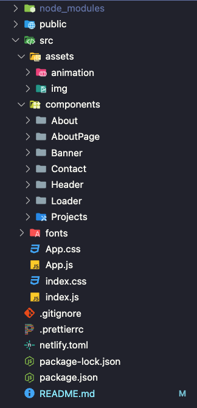

# Thomas Chevron - Portfolio

Bienvenue sur mon portfolio en ligne ! Ce site présente mes compétences, mes projets et des informations à mon sujet en tant que développeur web junior.

## 🚀 Fonctionnalités

- **Page d'accueil** : Introduction avec un design animé et un menu de navigation clair.
- **À propos de moi** : Informations sur mes formations, mes valeurs et ce que je recherche en tant que développeur.
- **Projets** : Liste de mes projets avec descriptions détaillées et animations.
- **Contact** : Icônes interactives pour me retrouver sur LinkedIn, GitHub ou m'envoyer un email.

## 📸 Aperçu


## 🛠️ Technologies utilisées

- **Front-end** :
  - HTML5, CSS3
  - JavaScript
  - React.js
  - Framer Motion pour les animations
- **Outils** :
  - GitHub pour le contrôle de version

## 📂 Arborescence

Voici une vue des dossiers principaux :  


## 💻 Installation

Clonez le dépôt sur votre machine locale :

```bash
git clone https://github.com/SC138/ThomasChevron-web.git
```

Installez les dépendances :

```bash
npm install
```

Lancez le site en mode développement :

```bash
npm start
```

## 🌐 Déploiement

Le site est hébergé sur Netlify : [Voir le site en ligne](https://thomaschevron.netlify.app/).

## 📞 Contact

Vous pouvez me retrouver sur :

- [LinkedIn](https://www.linkedin.com/in/thomas-chevron/)
- [GitHub](https://github.com/SC138/)
- Par email : [chevron.thomas33@gmail.com](mailto:chevron.thomas33@gmail.com)
